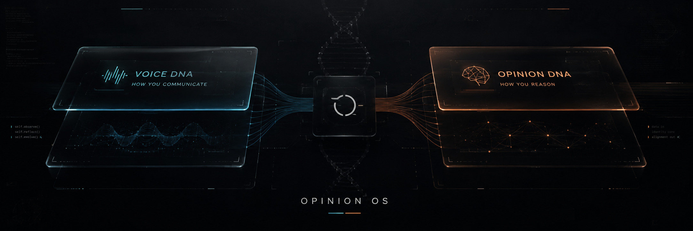

# Opinion-os



**Build your own Personal AI DNA.** Voice DNA — how you communicate. Opinion DNA — how you reason. Two modules, kept separate. Prompts, templates, and a one-click builder.

Your AI doesn't have to write like a machine. Give it your Voice DNA and your Opinion DNA, and it writes like you and reasons like you — without inventing beliefs for you.

## The problem

AI writes generically. It hedges, over-explains, fills space with transitions that do nothing, and defaults to a polite, balanced, nowhere stance. You read it and think: this doesn't sound like me.

Worse, if you just tell the AI "write like me," it parodies your surface quirks and still reasons like a machine. It mimics your slang but not your thinking.

## The solution

Personal AI DNA is two separate systems:

- **VOICE DNA** — how you communicate with an AI. Your phrasing, rhythm, fragments, shorthand, corrections, follow-ups, formatting, the way your style changes by task.
- **OPINION DNA** — how you reason. What evidence you trust, how you handle uncertainty, how you change your mind, what makes you reject an argument, what would make the other side right.

Voice DNA is behavioral. Opinion DNA is procedural. They are not the same thing.

The important design decision: **do not merge them too early.** If you collapse Voice and Opinion into one profile, the AI starts mistaking your communication style for your worldview. It takes how you talk and treats it as what you believe. That's the failure mode this system prevents.

## How it works

```text
                 ┌─────────────────┐
                 │  CHAT HISTORY   │
                 └────────┬────────┘
                          │
                          ▼
                 ┌─────────────────┐
                 │  VOICE ANALYSIS │
                 └────────┬────────┘
                          │
                          ▼
                    VOICE_DNA.md
                          │
                          ▼
                 ┌─────────────────┐
                 │ ADAPTIVE        │
                 │ OPINION         │
                 │ INTERVIEW       │
                 └────────┬────────┘
                          │
                          ▼
                   OPINION_DNA.md
                          │
                 ┌────────┴────────┐
                 │                 │
                 ▼                 ▼
             VOICE           REASONING
                 │                 │
                 └────────┬────────┘
                          ▼
                PERSONAL_AI_OS.md
                          │
                          ▼
                 RUNTIME PROMPT
                          │
                          ▼
                     OTHER AI
```

1. **VOICE DNA** — run the analyzer (prompt `01`) on your actual chat history. Only the messages you typed. Not AI output, not published writing. It produces `VOICE_DNA.md`.

2. **OPINION DNA** — run the interview (prompts `02` and `03`). The AI asks you questions one at a time, adapting each question to what you've already answered. It produces `OPINION_DNA.md`. It does not infer your beliefs from your writing.

3. **Synthesis** — optionally run `04` to combine them into a `PERSONAL_AI_OS.md`.

4. **Runtime** — use `05` as your runtime prompt. Paste it into an AI's system prompt with your two DNA files. The AI now communicates like you and reasons like you.

5. **Update** — when you have new history, run `06` and `07` to revise without rewriting from scratch.

## Quick start

If you don't want to understand the architecture, use [`00-ONE-CLICK.md`](00-ONE-CLICK.md). It runs all five phases in one prompt. Paste it with your chat history available, and get your VOICE_DNA.md, OPINION_DNA.md, PERSONAL_AI_OS.md, and runtime prompt in one go.

If you want more control, run `01` through `05` in order. The phases are more useful on their own.

## What's in this repo

```text
opinion-os/
├── 00-ONE-CLICK.md         # the full 5-phase build in one prompt
├── 01-VOICE-DNA-ANALYZER.md
├── 02-OPINION-DNA-INTERVIEW.md
├── 03-ADAPTIVE-INTERVIEW.md
├── 04-PERSONAL-OS-SYNTHESIS.md
├── 05-RUNTIME-PROMPT.md
├── 06-VOICE-UPDATE.md
├── 07-OPINION-UPDATE.md
├── README.md
├── concept.md
├── SECURITY.md
├── SKILL.md                 # reference — how to load the system as a Hermes skill
├── LICENSE                  # MIT
├── .gitignore
└── templates/
    ├── VOICE_DNA.md         # empty template
    ├── OPINION_DNA.md       # empty template
    └── PERSONAL_AI_OS.md    # empty template
```

### The prompts

- **`01` — Voice DNA Analyzer.** Feed it your chat history. It reverse-engineers how you communicate and produces a `VOICE_DNA.md`. Structured: voice summary, communication rules, sentence rhythm, vocabulary, formatting, personality, what you never do, signature patterns, before/after examples, replication prompt.

- **`02` — Opinion DNA Interview.** The AI interviews you one question at a time, no more than 7 questions, using real scenarios and trade-offs. Produces `OPINION_DNA.md`. Structured: core thinking principles, how you form opinions, evidence hierarchy, skepticism rules, claim strength, what changes your mind, angle generation, opinion boundaries, step-by-step framework, short prompt.

- **`03` — Adaptive Interview.** A better version of the interview. The AI chooses each question based on what's still unknown, optimizing for information gain instead of following a fixed list. Use this instead of `02` if you want a tighter interview.

- **`04` — Personal OS Synthesis.** Combines VOICE_DNA.md and OPINION_DNA.md into a unified `PERSONAL_AI_OS.md`, keeping the two layers separate.

- **`05` — Runtime Prompt.** The prompt you actually give an AI every day, with your two DNA files. Teaches it how to communicate with you, how to reason with you, how to disagree, how to handle uncertainty, and how to avoid inventing beliefs.

- **`06` — Voice Update.** Revise an existing VOICE_DNA.md when you have new history. Classify each change as confirmed, possible, or one-off. Don't rewrite from scratch.

- **`07` — Opinion Update.** Same thing for OPINION_DNA.md.

### The templates

Empty structures you fill in after running the analyzer and interview. They enforce the right shape so the files are actually usable by another AI.

- `templates/VOICE_DNA.md`
- `templates/OPINION_DNA.md`
- `templates/PERSONAL_AI_OS.md`

### concept.md

The two-module model and the flow, explained. The key idea: Voice and Opinion are different layers, and collapsing them is the failure mode.

### SECURITY.md

What never goes public. The short version: keep your DNA files private. They are your behavioral fingerprint.

### SKILL.md

A reference showing how the Opinion-os writing system is packaged as a Hermes skill, and how to load it to write or calibrate text in your own voice. Hermes-specific, optional. The prompts work with any AI.

## Who this is for

- Anyone who wants AI to write like them, not like a machine.
- Anyone who wants AI to reason in a way compatible with how they think.
- Writers, founders, researchers, operators — anyone who uses AI a lot and is tired of generic output.
- Teams who want a shared voice and reasoning standard for their AI.

## What the AI should do with your DNA files

When you give an AI your VOICE_DNA.md and OPINION_DNA.md, it should:

- match how you communicate, without parodying your typing
- reason in a way compatible with how you think
- not invent beliefs for you
- say when something is explicit, strong, possible, or unknown
- engage the actual argument when it disagrees
- treat corrections and follow-ups as new information

It should not:

- automatically agree
- automatically disagree
- confuse how you reason with what you believe
- make confidence stronger than the evidence supports
- force a replacement theory just because an old one failed

## Question & Answer

**How do I make AI write like me?**
Build your Voice DNA from your chat history (prompt `01`), build your Opinion DNA from the interview (prompts `02`/`03`), then use the runtime prompt (prompt `05`) with both files. The AI writes like you because it has your voice profile, and it reasons like you because it has your opinion profile.

**How do I clone my writing style to an AI?**
Voice DNA is the style clone. Run prompt `01` on your actual chat history — only the messages you typed. The analyzer reverse-engineers your phrasing, rhythm, fragments, shorthand, corrections, and formatting. The resulting VOICE_DNA.md is your style fingerprint. Give it to an AI with the runtime prompt.

**What's the difference between Voice DNA and Opinion DNA?**
Voice DNA is how you communicate. Opinion DNA is how you reason. Voice = expression. Opinion = thinking. They are different layers and should stay separate. If you merge them, the AI starts mistaking your style for your beliefs.

**Can I use this with Claude, ChatGPT, or any AI?**
Yes. The prompts are provider-agnostic. Paste them into any AI with your history available. The `SKILL.md` is Hermes-specific, but that's just a bonus for Hermes users. The prompts themselves work anywhere.

**Is this just a personality prompt?**
No. A personality prompt is a horoscope — "you are analytical, you value evidence." Personal AI DNA is two behavioral systems built from your actual history and your actual answers. Voice DNA is a fingerprint of how you prompt. Opinion DNA is a model of how you reason, built from an interview, not inferred from your writing.

**How do I stop AI from writing generically?**
Use the Opinion-os writing system. Load `opinion-os-stop-slop` to kill the obvious AI habits, and run the AI Writing Blacklist as the final pass. The `SKILL.md` shows how to load the system as a skill. Or just use the prompts here to build your own voice and opinion profiles — a real voice profile is the deeper fix.

**What is AI slop?**
The telltale habits of AI-generated prose: empty transitions, overused intensifiers, vague attributions, overblown frames, laundry-list paragraphs, fake rhetorical questions, manufactured urgency, cheerful chatbot artifacts, emoji and bold crutches, and the AI conclusion pattern. The full list is in the AI Writing Blacklist, which is part of the Opinion-os skill in the private repo.

**Can I use this for my company or team?**
Yes. Build a shared Voice DNA and Opinion DNA for the team, keep them private, and use the runtime prompt with them. The prompts and templates are the same either way.

**Is this free?**
Yes. The prompts, templates, and concept doc are MIT-licensed. Your DNA files are yours and should stay private.

## Security

Read [`SECURITY.md`](SECURITY.md). The short version:

- Keep your DNA files in a private repo or a private folder.
- Do not commit raw chat logs with other people's data or credentials.
- Do not commit `.env`, `config.yaml` with keys, `auth.lock`, `state.db`, or anything like that.
- The public repo does not contain anyone's actual DNA files.

## License

MIT. See [`LICENSE`](LICENSE). The prompts, templates, and concept doc are open. Your DNA files are yours.

## Credits

Opinion-os was built from a real conversation about analyzing how someone prompts an AI, and deliberately separating how they communicate from how they reason. The two-module model is the core idea. The prompts and templates are the distributable form.
